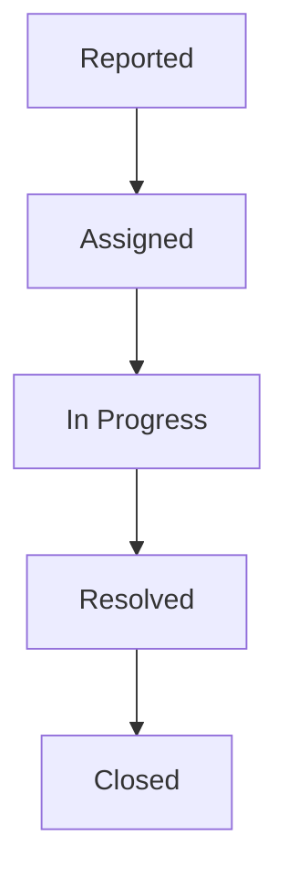
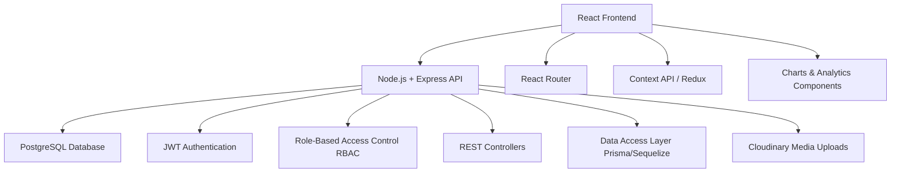

<p align="center">
  
</p>

<p align="center">
  <!-- Tech Stack Badges -->
  
  
  
  
  
  
</p>

## Project Overview

The **Smart Hostel Issue Tracking System** is a full-stack application to **report, track, and resolve hostel maintenance issues** efficiently. Students submit issues, admins assign and monitor them, and analytics provide actionable insights.

---

## Features ✨

* **Student Portal:** Report issues, view own and public issues, comment, view announcements.
* **Admin Portal:** Assign issues, update status, post announcements, moderate comments, view analytics.
* **Lost & Found:** Report lost/found items, manage claims.
* **Analytics:** Track issue trends, resolution times, hostel/block-wise stats.
* **Role-Based Access:** JWT auth and password hashing for secure RBAC.

---

## Issue Workflow 🔄



> Students report → Admin assigns → Caretaker resolves → Admin closes issue. All status changes timestamped.

---
## System Architecture



---
## Technology Stack 🛠️

* **Frontend:** React.js + Tailwind CSS
* **Backend:** Node.js + Express.js
* **Database:** PostgreSQL
* **ORM:** Prisma or Sequelize
* **Authentication:** JWT + bcrypt
* **Media Uploads:** Cloudinary (Multer)
* **Charts:** Chart.js or Recharts

---

## Project Structure

```
smart-hostel-issue-tracker/
├── .gitignore                          # Git ignore rules (node_modules, .env, etc.)
├── docker-compose.yml                   # Docker setup for local DB + app (full code provided earlier)
├── README.md                            # Project documentation (full code provided in last response)
├── backend/                             # Backend application (Node.js + Express)
│   ├── .env.example                     # Environment variables template (full code provided earlier)
│   ├── Dockerfile                       # Docker config for backend (full code provided earlier)
│   ├── package.json                     # Backend dependencies and scripts (full code provided earlier)
│   ├── prisma/                          # Database schema and migrations
│   │   ├── schema.prisma                # PostgreSQL schema with models (full code provided earlier)
│   │   └── seed.js                      # Seed data for demo/testing (full code provided earlier)
│   └── src/                             # Source code
│       ├── app.js                       # Express app setup (full code provided earlier)
│       ├── controllers/                 # API controllers
│       │   ├── analytics.js             # Analytics controller (full code provided in code response)
│       │   ├── announcements.js         # Announcements controller (full code provided in code response)
│       │   ├── auth.js                  # Auth controller (full code provided in code response)
│       │   ├── comments.js              # Comments controller (full code provided in code response)
│       │   ├── issues.js                # Issues controller (full code provided in code response)
│       │   └── lostAndFound.js          # Lost & Found controller (full code provided in code response)
│       ├── middleware/                  # Middleware for auth/RBAC
│       │   └── auth.js                  # Authentication & authorization middleware (full code provided earlier)
│       ├── routes/                      # API routes
│       │   ├── analytics.js             # Analytics routes (full code provided in code response)
│       │   ├── announcements.js         # Announcements routes (full code provided in code response)
│       │   ├── auth.js                  # Auth routes (full code provided in code response)
│       │   ├── issues.js                # Issues routes (full code provided in code response)
│       │   └── lostAndFound.js          # Lost & Found routes (full code provided in code response)
│       ├── services/                    # Business logic services
│       │   └── cloudinary.js            # Cloudinary upload service (full code provided earlier)
│       ├── utils/                       # Utility helpers (e.g., JWT, validation) - Empty for now, add as needed
│       └── server.js                    # Entry point for the server (full code provided earlier)
└── frontend/                            # Frontend application (React + Tailwind)
    ├── .env.example                     # Frontend environment template (e.g., REACT_APP_API_URL)
    ├── Dockerfile                       # Docker config for frontend (similar to backend, build React app)
    ├── package.json                     # Frontend dependencies and scripts (full code provided earlier)
    ├── public/                          # Static assets (e.g., index.html, favicon)
    │   └── index.html                   # React app HTML template (default Create React App)
    ├── src/                             # Source code
    │   ├── App.js                       # Main React app component (full code provided earlier)
    │   ├── components/                  # Reusable React components
    │   │   ├── Analytics.js             # Analytics dashboard component (New: Uses Recharts for charts, fetches data from /api/analytics)
    │   │   ├── AnnouncementForm.js      # Form for creating announcements (New: Form with inputs for title, content, targets)
    │   │   ├── Announcements.js         # List of announcements (New: Displays targeted announcements)
    │   │   ├── IssueForm.js             # Form for reporting issues (full code provided earlier)
    │   │   ├── IssueList.js             # List of issues with status badges (full code provided in code response)
    │   │   └── LostAndFound.js          # Lost & Found component (New: Form and list for reporting/claiming items)
    │   ├── hooks/                       # Custom React hooks
    │   │   └── useAuth.js               # Auth hook for login/logout (full code provided earlier)
    │   ├── pages/                       # Page components
    │   │   ├── AdminDashboard.js        # Admin dashboard page (full code provided in code response)
    │   │   ├── Login.js                 # Login page (full code provided in code response)
    │   │   └── StudentDashboard.js      # Student dashboard page (full code provided earlier)
    │   ├── utils/                       # Utility helpers (e.g., API calls) - Empty for now, add axios helpers
    │   └── index.js                     # React app entry point (default Create React App)
    └── tailwind.config.js               # Tailwind CSS configuration (default setup)

```

---

## Installation & Setup ⚡

1. **Clone the repository**

```bash
git clone https://github.com/Ardhaya-Johari/smart-hostel-issue-tracker.git
cd smart-hostel-issue-tracker
```

2. **Backend Setup**

```bash
cd backend
npm install
cp .env.example .env  # fill your env variables
npx prisma migrate dev  # run migrations
npm run dev             # start backend server
```

3. **Frontend Setup**

```bash
cd ../frontend
npm install
cp .env.example .env   # set REACT_APP_API_URL to backend URL
npm start               # start frontend
```

> Open browser at `http://localhost:5000`

4. **Optional: Docker**

```bash
docker-compose up --build
```

> Runs backend, frontend, and PostgreSQL containers.

---

## Contribution 🤝

1. Fork the repo
2. Create a branch:

```bash
git checkout -b feature/your-feature-name
```

3. Commit changes:

```bash
git commit -m "Add feature description"
```

4. Push branch:

```bash
git push origin feature/your-feature-name
```

5. Open Pull Request on main repo.

---

## Author 👤

**Ardhaya Johari**

* GitHub: [https://github.com/Ardhaya-Johari](https://github.com/Ardhaya-Johari)
* LinkedIn: [https://www.linkedin.com/in/ardhaya-johari-819275321/](https://www.linkedin.com/in/ardhaya-johari-819275321/)

---

## License 📄

MIT License
